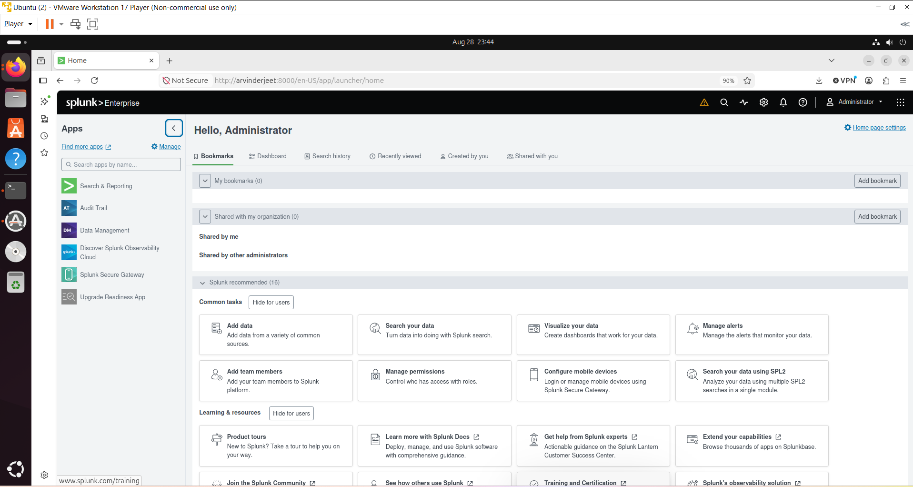
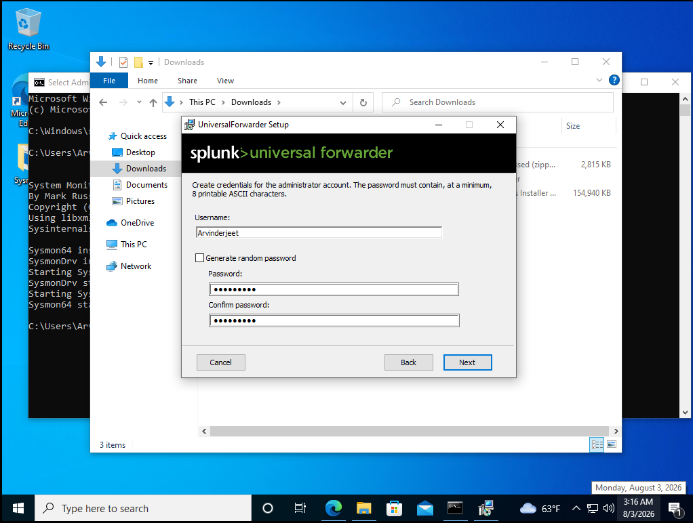
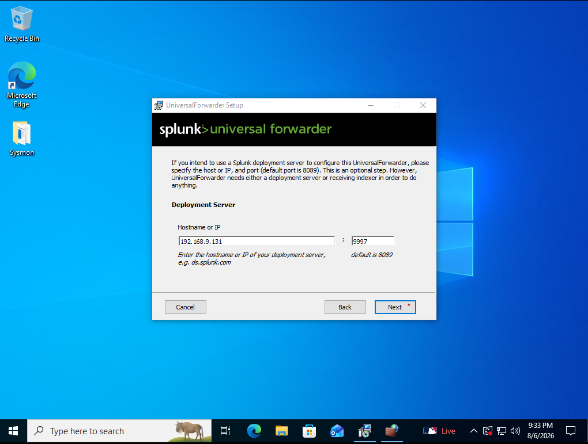
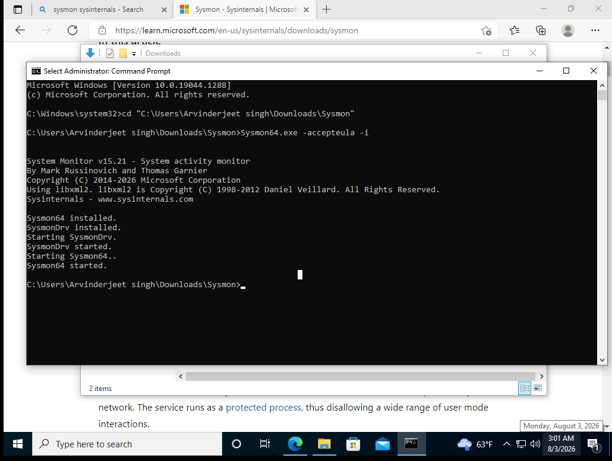
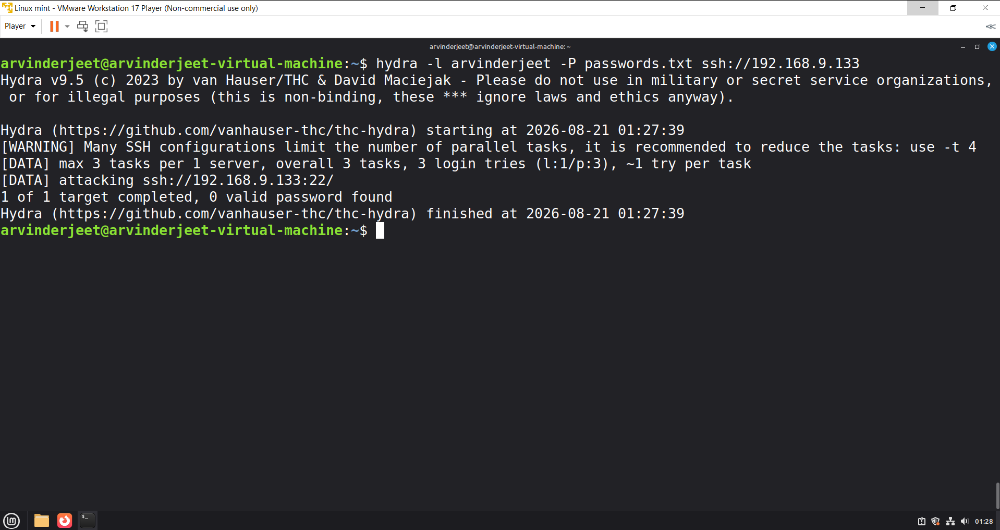
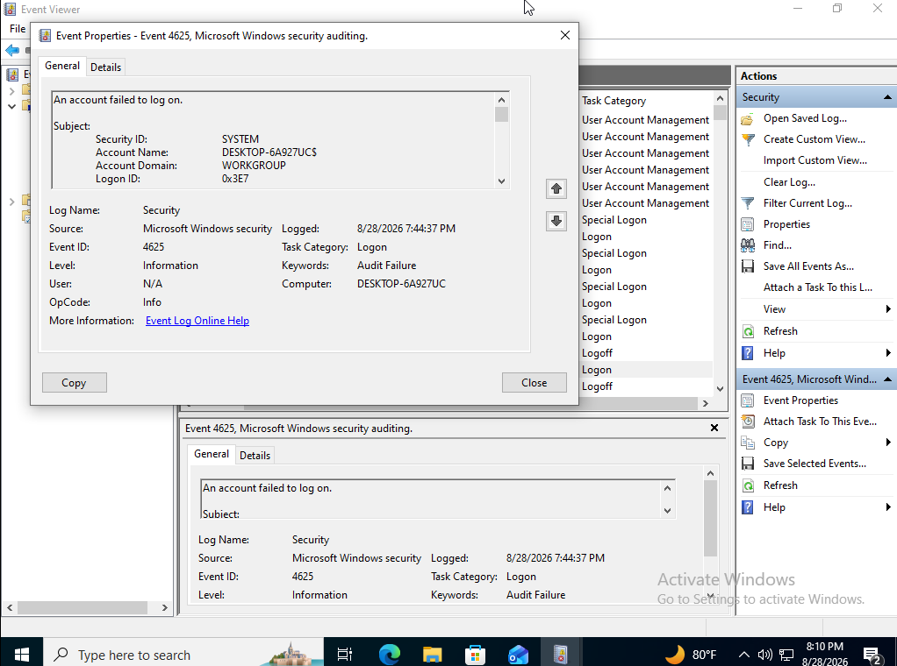
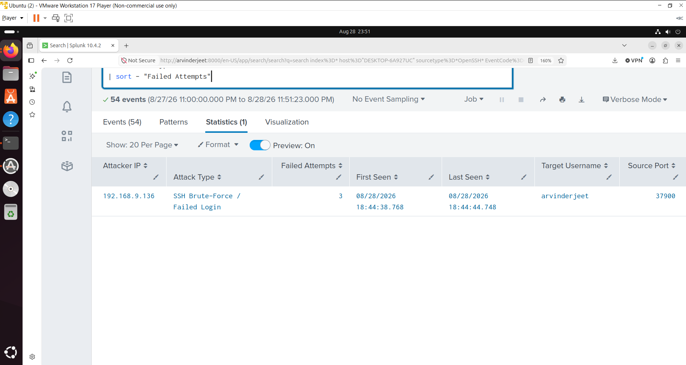
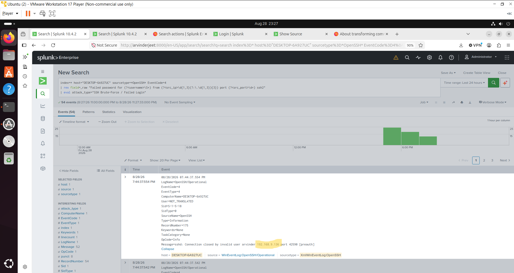
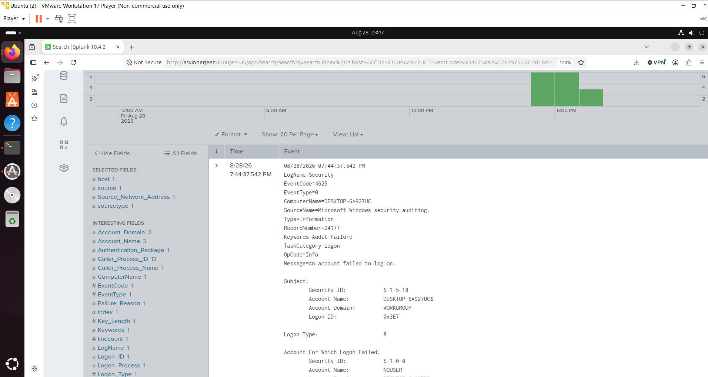

# 🔐 Splunk SSH Brute-Force Detection & SIEM Lab

## 📌 Project Overview

This project demonstrates a hands-on **SOC/SIEM security monitoring lab** built using VirtualBox.

The objective was to simulate SSH authentication activity in an isolated lab environment, collect Windows security telemetry, forward the logs to Splunk, and investigate failed authentication attempts associated with potential brute-force activity.

The project demonstrates the complete workflow:

**Attack Simulation → Windows Logging → Log Forwarding → Splunk Ingestion → Detection → Investigation**

---

## 🏗️ Lab Architecture

```text
                         ┌──────────────────────────┐
                         │      Ubuntu Server       │
                         │                          │
                         │       Splunk SIEM        │
                         │   Log Collection &       │
                         │      Investigation       │
                         └────────────▲─────────────┘
                                      │
                                      │ Logs
                                      │
                         ┌────────────┴─────────────┐
                         │        Windows 10        │
                         │                          │
                         │       OpenSSH            │
                         │       Sysmon              │
                         │  Splunk Universal        │
                         │      Forwarder           │
                         │                          │
                         │    SSH Target System     │
                         └────────────▲─────────────┘
                                      │
                                      │ SSH Authentication
                                      │ Testing
                                      │
                         ┌────────────┴─────────────┐
                         │       Linux Mint         │
                         │                          │
                         │   Security Testing VM    │
                         │                          │
                         │     SSH Test Tool        │
                         └──────────────────────────┘
```

---

# 🎯 Project Objectives

* Build a virtualized cybersecurity lab using VirtualBox
* Configure Windows 10 as an SSH target
* Install and configure Splunk Universal Forwarder on Windows
* Configure the Splunk server/host connection
* Install Sysmon for additional Windows telemetry
* Generate authorized SSH authentication testing from Linux Mint
* Capture authentication events in Windows Event Viewer
* Forward relevant Windows logs to Splunk
* Search and investigate failed SSH authentication events
* Identify source IP addresses and targeted usernames
* Demonstrate a basic SOC-style brute-force detection workflow

---

# 🖥️ Lab Environment

| System        | Role                | Technology                                    |
| ------------- | ------------------- | --------------------------------------------- |
| Ubuntu Server | SIEM / Log Analysis | Splunk                                        |
| Windows 10    | Target Endpoint     | OpenSSH + Sysmon + Splunk Universal Forwarder |
| Linux Mint    | Security Testing    | SSH testing tools                             |
| VirtualBox    | Virtualization      | Virtual Lab Environment                       |

---

# 🧰 Technologies Used

* Splunk Enterprise
* Splunk Universal Forwarder
* Windows 10
* Ubuntu Server
* Linux Mint
* OpenSSH
* Sysmon
* Windows Event Viewer
* VirtualBox
* SIEM
* Windows Event Logs
* SSH
* Network Security Monitoring

---

# 🔄 Project Workflow

```text
┌──────────────────────┐
│     Linux Mint       │
│  SSH Authentication  │
│       Testing        │
└──────────┬───────────┘
           │
           ▼
┌──────────────────────┐
│      Windows 10      │
│                      │
│ OpenSSH              │
│ Sysmon               │
│ Event Viewer         │
│ Splunk Forwarder     │
└──────────┬───────────┘
           │
           │ Forwarded Logs
           ▼
┌──────────────────────┐
│    Ubuntu Server     │
│                      │
│   Splunk Enterprise  │
└──────────┬───────────┘
           │
           ▼
┌──────────────────────┐
│ Detection & Analysis │
│                      │
│ Failed SSH Attempts  │
│ Source IP            │
│ Username             │
│ Event Details        │
└──────────────────────┘
```

---

# 📸 Project Walkthrough

## 1. Splunk Dashboard

The Splunk dashboard provides visibility into authentication activity collected from the Windows endpoint.

The dashboard can be used to monitor failed authentication attempts and identify suspicious activity.



---

## 2. Splunk Universal Forwarder Installation on Windows

The Splunk Universal Forwarder was installed on the Windows 10 endpoint to collect and forward relevant Windows event logs to the Splunk server.



---

## 3. Splunk Forwarder Host IP Configuration

The Windows Splunk Universal Forwarder was configured to communicate with the Splunk server over the lab network.



---

## 4. Sysmon Installation

Sysmon was installed on the Windows 10 endpoint to provide additional system and security telemetry.

This telemetry can help security analysts investigate activity occurring on the endpoint.



---

## 5. SSH Attack Simulation

SSH authentication testing was performed from the Linux Mint security-testing VM against the Windows 10 SSH service in the isolated lab environment.

The purpose was to generate authentication events that could subsequently be detected and investigated in Splunk.



---

## 6. Windows Event Viewer

The resulting SSH authentication activity was captured in the Windows OpenSSH Operational event log.

This provided the raw endpoint event that could be forwarded to Splunk for centralized analysis.



---

## 7. Splunk Brute-Force Event Detection

The Windows OpenSSH events were ingested into Splunk and investigated for repeated failed authentication attempts.

The investigation focused on information such as:

* Source IP address
* Target username
* Timestamp
* Computer name
* Event information
* Authentication status

Example event:

```text
sshd: Failed password for arvinderjeet from 192.168.9.136
```



---
## 8. Attack via SSH Detection

The Windows OpenSSH events were ingested into Splunk and investigated for repeated failed authentication attempts.

The investigation focused on information such as:

* Source IP address
* Target username
* Timestamp
* Computer name
* Event information
* Authentication status

Example event:

```text
sshd: Failed password for arvinderjeet from 192.168.9.136
```



---
## 9. Event 4625 unknown user attempt login Detection

The Windows OpenSSH events were ingested into Splunk and investigated for repeated failed authentication attempts.

The investigation focused on information such as:

* unknown user
* Target username
* Timestamp
* Computer name
* Event information



---
# 🔎 Splunk Investigation

Example search used during the investigation:

```spl
index=* "Failed password"
```

A more targeted search can be used to identify OpenSSH authentication failures:

```spl
index=* "sshd" "Failed password"
```

### Source IP Investigation

```spl
index=* "Failed password"
| rex "from (?<source_ip>\d{1,3}(?:\.\d{1,3}){3})"
| stats count by source_ip
| sort - count
```

### Username Investigation

```spl
index=* "Failed password"
| rex "Failed password for (?<username>\S+)"
| stats count by username
| sort - count
```

### Authentication Activity Over Time

```spl
index=* "Failed password"
| timechart count
```

---

# 🛡️ Detection & Investigation Process

The project demonstrates a simplified SOC investigation workflow:

```text
1. Generate SSH Authentication Activity
              ↓
2. Windows OpenSSH Records Event
              ↓
3. Event Appears in Windows Event Viewer
              ↓
4. Splunk Universal Forwarder Collects Logs
              ↓
5. Logs Are Forwarded to Splunk
              ↓
6. Splunk Searches Authentication Events
              ↓
7. Failed Attempts Are Identified
              ↓
8. Source IP & Username Are Investigated
              ↓
9. Activity Is Visualized / Monitored
```

---

# 📊 Security Findings

During testing, failed SSH authentication events were successfully observed and investigated.

The events provided useful information for security monitoring, including:

* Failed authentication status
* Source IP address
* Target username
* Event timestamp
* Windows host information
* OpenSSH event details

Repeated failed authentication attempts from the same source can be an indicator of possible brute-force activity and should be investigated in a real SOC environment.

---

# 🧠 Key Learning Outcomes

This project provided hands-on experience with:

### SIEM

* Splunk installation and configuration
* Log ingestion
* Splunk searching
* Event investigation
* Dashboard creation

### Windows Security

* Windows Event Viewer
* OpenSSH logging
* Sysmon
* Security telemetry
* Authentication event analysis

### Networking

* VirtualBox networking
* Host-to-host communication
* IP addressing
* SSH connectivity
* Log forwarding between systems

### SOC Operations

* Security event investigation
* Source IP identification
* Authentication monitoring
* Brute-force detection concepts
* Log correlation
* Troubleshooting telemetry collection

---

# 🚀 Future Improvements

Future versions of this project could include:

* Automated Splunk alerts for repeated SSH failures
* Threshold-based brute-force detection
* Source IP reputation/enrichment
* More detailed Splunk dashboards
* Windows Event ID correlation
* Additional Sysmon detections
* Authentication success/failure correlation
* Incident-response playbooks
* MITRE ATT&CK technique mapping
* Additional endpoints and attack scenarios

---

# 📁 Repository Structure

```text
splunk-ssh-bruteforce-detection-lab/
│
├── README.md
│
├── screenshots/
│   ├── 01-splunk-dashboard.png
│   ├── 02-splunk-forwarder-install-windows.png
│   ├── 03-splunk-forwarder-host-ip.png
│   ├── 04-sysmon-installation.png
│   ├── 05-hydra-ssh-attack.png
│   ├── 06-windows-event-viewer.png
│   └── 07-splunk-bruteforce-event.png
│
├── splunk/
│   └── searches.md
│
└── documentation/
    └── lab-setup.md
```

---

# ⚠️ Disclaimer

This project was conducted in an isolated virtual lab environment for educational and cybersecurity learning purposes.

All security testing should only be performed against systems that you own or have explicit authorization to test.

---

# 👨‍💻 Skills Demonstrated

**Splunk | SIEM | SOC | Windows Security | Linux | OpenSSH | Sysmon | Log Analysis | Security Monitoring | Network Troubleshooting | VirtualBox | Incident Investigation**
